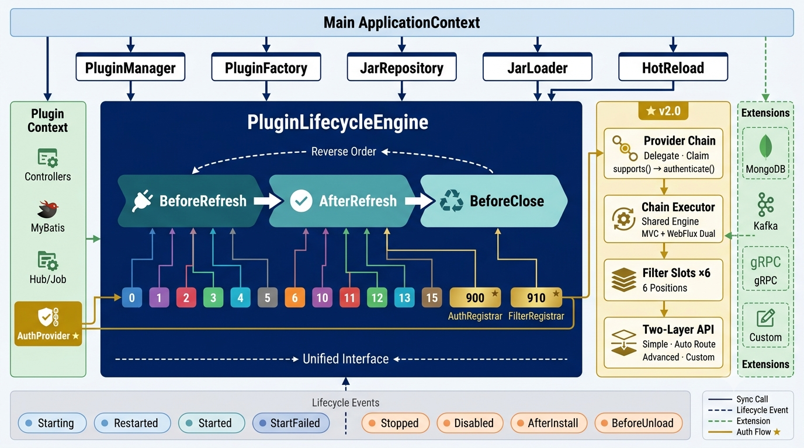
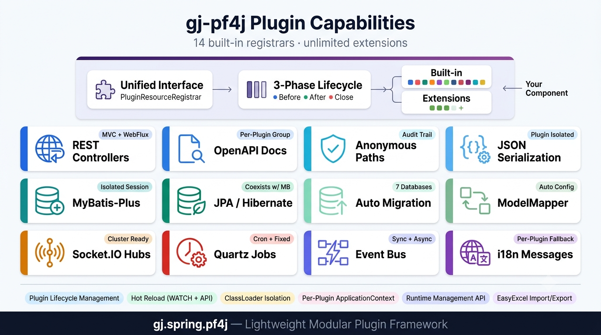
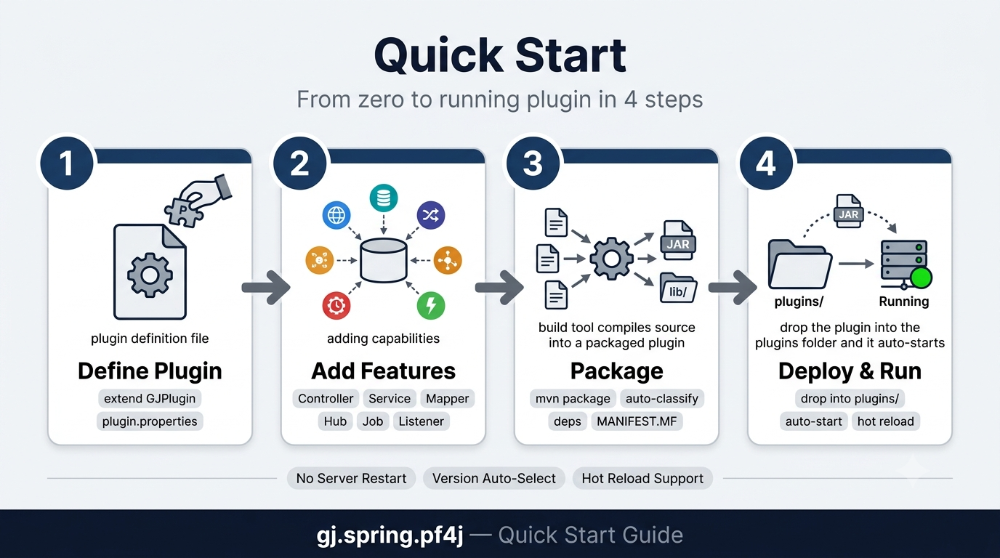

# gj.spring.pf4j

[](https://adoptium.net/)
[](https://github.com/wangpengxpy/gj.spring.pf4j/blob/main/LICENSE)
[](https://central.sonatype.com/artifact/io.github.wangpengxpy/gj-pf4j)
[](https://github.com/wangpengxpy/gj.spring.pf4j/stargazers)

A lightweight, modular plugin framework powered by PF4J and Spring, with no heavyweight Spring Boot dependency. Supports both Spring MVC and Spring WebFlux routing — auto-adapts to the host application's web stack.

> [中文文档](README_CN.md)

<p align="center">
  
</p>

---

## Core Capabilities

<p align="center">
  
</p>

- **[Plugin Lifecycle Management](https://github.com/wangpengxpy/gj.spring.pf4j/wiki/Plugin-Lifecycle)** — install, disable, restart, unload, and delete plugins at runtime
- **[Plugin Hot-Reload](https://github.com/wangpengxpy/gj.spring.pf4j/wiki/Plugin-Hot-Reload)** — hot-reload via API-driven workflow or file watcher; lifecycle events for custom orchestration
- **[Runtime Plugin Management API](https://github.com/wangpengxpy/gj.spring.pf4j/wiki/Runtime-Management-API)** — `GJPluginService` provides lock-controlled runtime management APIs
- **[REST Endpoints](https://github.com/wangpengxpy/gj.spring.pf4j/wiki/REST-Endpoints)** — `@RestController` beans auto-detected and registered into the main app's route table, supporting both MVC and WebFlux
- **[Dual Routing Mode](https://github.com/wangpengxpy/gj.spring.pf4j/wiki/REST-Endpoints#52-spring-mvc-vs-webflux-dual-routing)** — Spring MVC (Servlet) and Spring WebFlux (Reactive); plugins require zero changes
- **[OpenAPI Documentation](https://github.com/wangpengxpy/gj.spring.pf4j/wiki/OpenAPI)** — SpringDoc-powered; each plugin auto-generates an independent `GroupedOpenApi`
- **[MyBatis-Plus Data Access](https://github.com/wangpengxpy/gj.spring.pf4j/wiki/Data-Access)** — per-plugin `SqlSessionFactory`, `SqlSessionTemplate`, and `TransactionManager`, sharing host `DataSource`
- **[JPA Data Access](https://github.com/wangpengxpy/gj.spring.pf4j/wiki/Data-Access)** — Hibernate-powered per-plugin `EntityManagerFactory` and `JpaTransactionManager`; coexists with MyBatis-Plus
- **[SQL Keyword Quoting](https://github.com/wangpengxpy/gj.spring.pf4j/wiki/Data-Access)** — auto-wraps column names with DB-specific quote characters via MyBatis-Plus `InnerInterceptor`
- **[Database Auto-Migration](https://github.com/wangpengxpy/gj.spring.pf4j/wiki/Database-Auto-Migration)** — automatic `@TableName` entity schema migration (CREATE TABLE / ADD COLUMN only), 7 databases, production-safe
- **[Object Mapping](https://github.com/wangpengxpy/gj.spring.pf4j/wiki/Object-Mapping)** — ModelMapper; plugins implement `GJPluginModelMapperConfig`, auto-discovered via Spring bean scanning
- **[Import/Export](https://github.com/wangpengxpy/gj.spring.pf4j/wiki/Import-Export)** — EasyExcel multi-sheet read/write with automatic i18n header translation
- **[Real-Time Communication](https://github.com/wangpengxpy/gj.spring.pf4j/wiki/Real-Time-Communication)** — netty-socketio Hub pattern (SignalR-style) with group and user-targeted messaging
- **[Scheduled Tasks](https://github.com/wangpengxpy/gj.spring.pf4j/wiki/Scheduled-Tasks)** — Quartz-based cron, fixed-interval, and run-once execution
- **[In-Process Event Bus](https://github.com/wangpengxpy/gj.spring.pf4j/wiki/Event-Bus)** — sync/async publishing with Ant-style wildcard matching
- **[Internationalization (i18n)](https://github.com/wangpengxpy/gj.spring.pf4j/wiki/Internationalization)** — per-plugin `messages.properties` with fallback to the host application

---

## Quick Start

<p align="center">
  
</p>

```bash
# 1. Install the archetype locally
cd src/gj-archetypes
mvn clean install

# 2. Generate a plugin project
mvn archetype:generate \
  -DarchetypeGroupId=io.github.wangpengxpy \
  -DarchetypeArtifactId=gj-archetype \
  -DarchetypeVersion=1.2.3 \
  -DgroupId=com.example \
  -DpluginName=user
```

---

**Full documentation** → [Wiki](https://github.com/wangpengxpy/gj.spring.pf4j/wiki)
